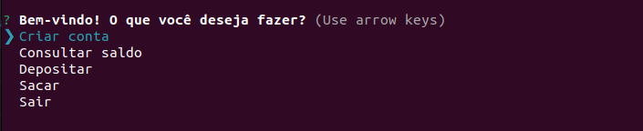

# Sistema de banco eletrônico desenvolvido em NodeJS

## Como preparar o ambiente?
Antes de tudo, é necessário ter o NodeJS e o NPM instalado em seu computador. Basta instalar através desse <a href="https://nodejs.org/en/">link</a>.

---

Abra o terminal no diretório em questão e execute o seguinte comando:


```
npm install
```

## Como executar?

```
npm start
```
---

## Resultado



## Tecnologias
- NodeJS